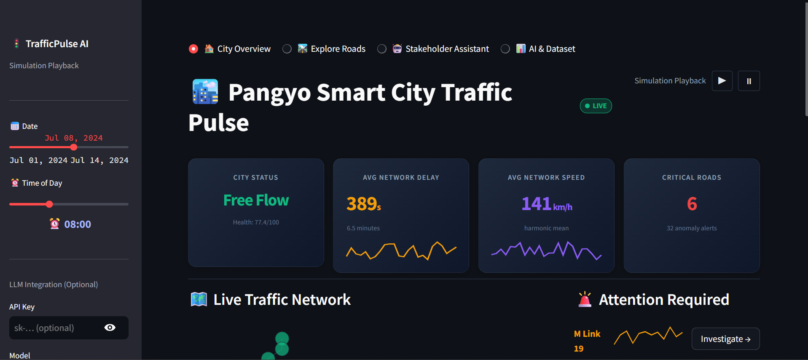
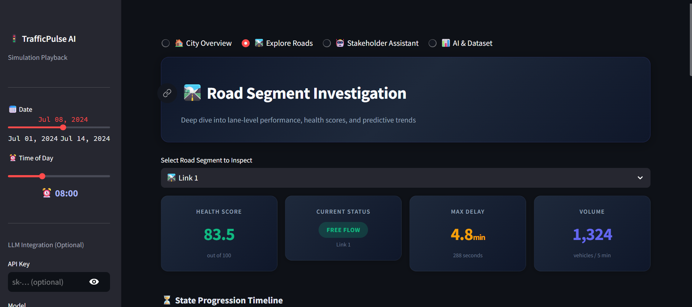
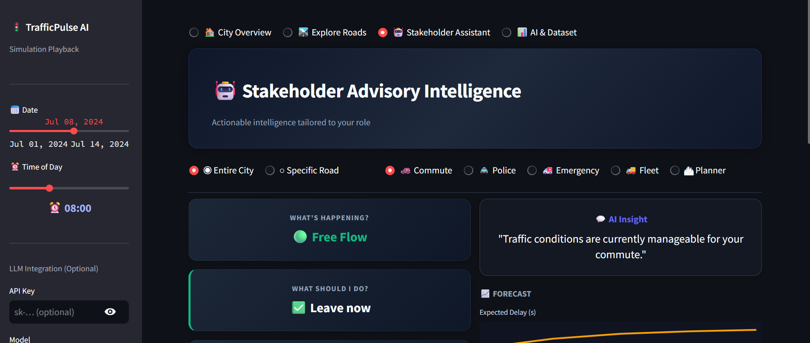
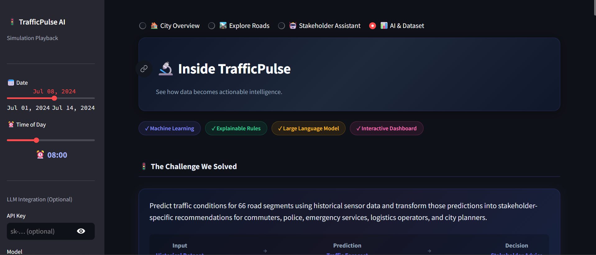

# 🚦 TrafficPulse AI
**Predictive Traffic Intelligence & Stakeholder Advisory System**

[](https://www.python.org/downloads/)
[](https://streamlit.io/)
[](https://opensource.org/licenses/MIT)

TrafficPulse is an advanced, interactive traffic management platform that transforms raw sensor data into highly accurate predictions and human-readable, actionable advice. Designed for city planners, emergency services, commuters, and fleet dispatchers, TrafficPulse bridges the gap between complex Machine Learning models and everyday decision-making.

---

## 🏆 The Challenge
City traffic networks generate massive amounts of data, but raw numbers (like `occupancy=71%` or `delay=382s`) are useless to non-technical stakeholders in a crisis. 

**Our goal:** Predict traffic conditions for 66 road segments using historical sensor data and transform those mathematical predictions into stakeholder-specific recommendations in plain English.

## ✨ The Solution
TrafficPulse solves this through a rigorous 4-step intelligence pipeline:
1. **Data Ingestion:** 266,112 historical observations across 14 days and 66 road links.
2. **Machine Learning:** Gradient Boosting models predict 15-min and 30-min future horizons for Speed, Occupancy, and Delay with an **R² accuracy of up to 0.96**.
3. **Decision Engine:** A deterministic, fully explainable rule-based engine categorizes the ML output into Health Scores (0-100) and congestion levels.
4. **Natural Language AI:** An LLM acts *only as a translator* (never inventing numbers), converting the rule-based decisions into human-readable advice for 5 different stakeholder profiles.

---

## 📸 Platform Features

### 1. City Overview (Live Control Room)
A bird's-eye view of the entire city network. Features a live topological graph of 66 nodes, delay distribution charts, and an automated "Read Aloud" City Bulletin to alert operators of critical bottlenecks.



### 2. Stakeholder Assistant (Role-Based Intelligence)
Choose your role (Commuter, Police, Emergency, Logistics, or Planner) and instantly receive tailored, actionable advice. 
*Example: Instead of showing raw data, the Emergency Services view instantly identifies the fastest corridors and ranks links by lowest predicted delay.*



### 3. Explore Roads (Deep-Dive Analytics)
A granular, lane-by-lane investigation tool. It tracks vehicle volume, harmonic speed vs arithmetic speed, and flags live anomalies (like sudden speed drops or queue spikes) using standard deviations.



### 4. Inside TrafficPulse (Transparency & Trust)
A dedicated transparency page built specifically for ML evaluation. It breaks down the entire prediction journey, feature importance, R² accuracy gauges, and explains exactly *why* our AI is trustworthy (ML predicts, Rules decide, LLM explains).



---

## 💻 Tech Stack
* **Frontend:** Streamlit, HTML/CSS (Glassmorphism UI)
* **Data & ML:** Pandas, NumPy, Scikit-Learn, LightGBM/XGBoost
* **Visualizations:** Plotly, NetworkX
* **NLP:** OpenAI API (for narrative translation)

---

## 🚀 How to Run Locally

1. **Clone the repository:**
   ```bash
   git clone https://github.com/PAYALPJENA/traffic-pulse.git
   cd traffic-pulse
   ```

2. **Create a virtual environment:**
   ```bash
   python -m venv venv
   source venv/bin/activate  # On Windows use: .\venv\Scripts\activate
   ```

3. **Install dependencies:**
   ```bash
   pip install -r requirements.txt
   ```

4. **Run the application:**
   ```bash
   streamlit run app.py
   ```

---
*Built with ❤️ for the Hackathon.*
